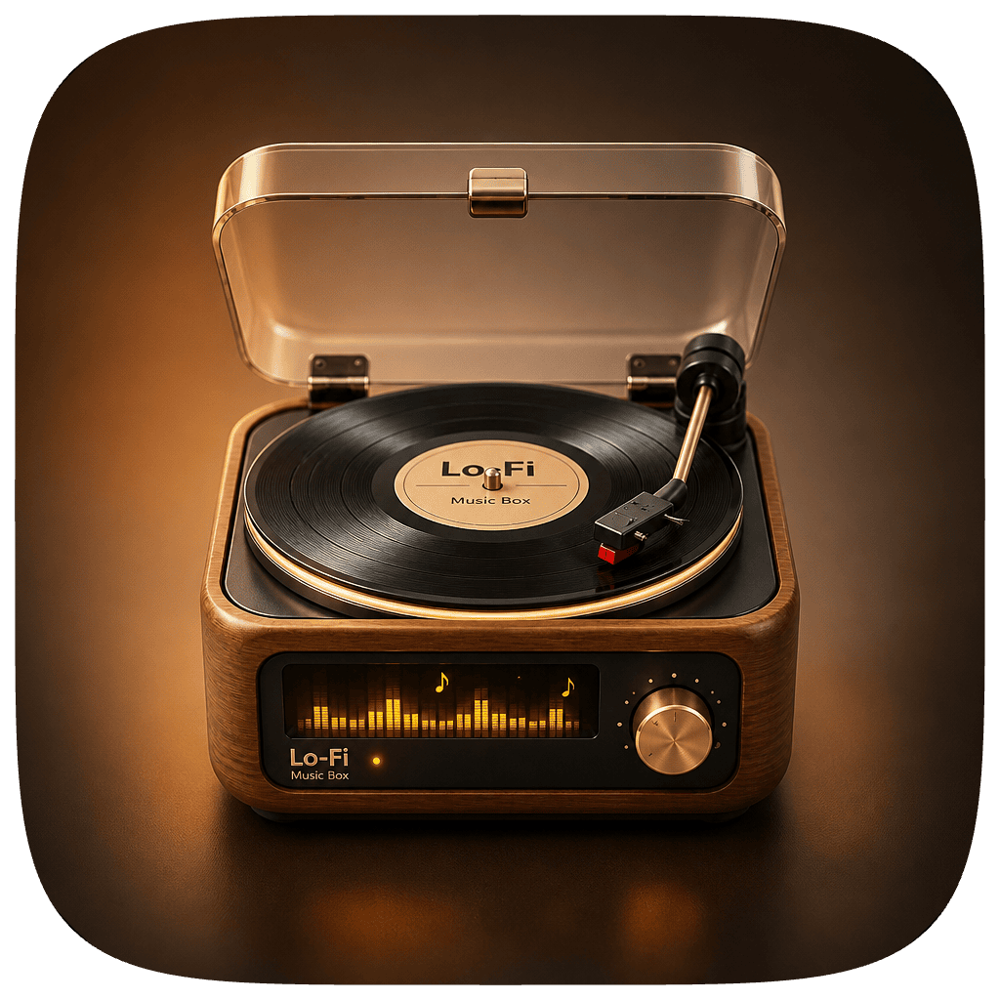
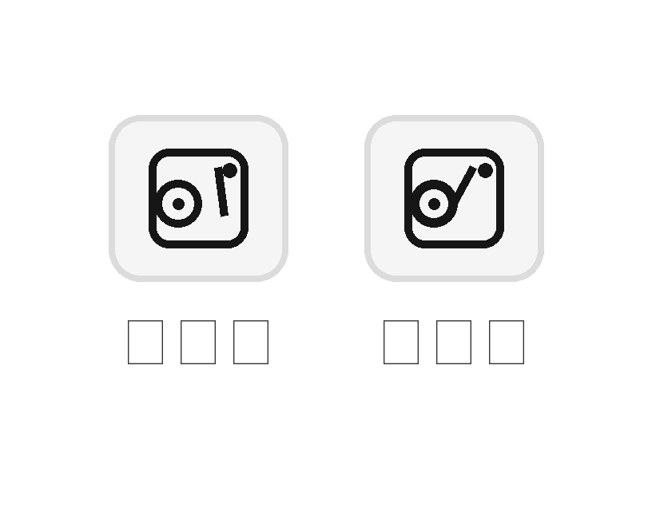

# Lo-Fi Music Box

> [English](README.md) · 中文

<p align="center">
  
</p>

<p align="center">
  一台会转的复古 macOS 桌面音乐盒。<br/>
  A tiny retro-turntable music box that lives on your macOS desktop.
</p>

<p align="center">
  <a href="#-下载与安装"></a>
  <a href="#-开源协议"></a>
  <a href="#"></a>
  <a href="#"></a>
  <a href="#"></a>
</p>

Lo-Fi Music Box 是一个 SwiftUI + AppKit 编写的 macOS 小组件，围绕"专注氛围电台"打造：内置 Lo-Fi / Chill 电台、支持你自己添加 MP3 直连流 / HLS 直播 / 哔哩哔哩直播间，配一台 3D 拟物唱机、菜单栏常驻入口、频道可用性检测和番茄式专注计时。

零第三方依赖，全部走系统 AVFoundation + SwiftUI + AppKit，打包出来就是一份能双击运行的 `.app`。

---

## 目录

- [功能亮点](#-功能亮点)
- [截图](#-截图)
- [下载与安装](#-下载与安装)
- [从源码构建](#-从源码构建)
- [数据与偏好](#-数据与偏好)
- [键盘快捷键](#-键盘快捷键)
- [项目结构](#-项目结构)
- [开发约定](#-开发约定)
- [路线图](#-路线图)
- [赞赏支持](#-赞赏支持)
- [致谢](#-致谢)
- [开源协议](#-开源协议)

---

## ✨ 功能亮点

- **一体化复古唱机**：整窗就是一台连续木质机身，唱盘嵌在顶面、深色琥珀数显屏显示频道信息、黄铜控制台做在前面板上。
- **3D 拟物换片动画**：黑胶旋转 + 唱针带 3D 透视的"抬-落"动画，切歌时先抬针到中位、停顿、再落回——模拟实体唱机换片。
- **菜单栏常驻**：`MenuBarExtra` 固定一枚复古唱机图标，下拉菜单可一键切到任意频道；主窗口无 titlebar，左上角关闭是隐藏到菜单栏（不退出），可随时再打开。
- **频道管理面板**：`Cmd+,` 打开设置面板，支持增删自定义频道、编辑或隐藏内置频道；内置频道修改仅保存差异字段，App 升级不覆盖你的改动。
- **可用性检测**：单频道按需检测 + 全量批量检测 + 后台周期性自动检测（`5 / 10 / 30 / 60` 分钟可选，支持"仅播放空闲时"），结果反映在频道排序上。
- **哔哩哔哩直播原生播放**：把直播间地址直接当频道，App 解析成 HLS 直链交给 AVPlayer 播；主播未开播时会明确标不可用，不会假装能播。
- **专注时长统计**：每分钟 tick 累计今日/历史专注分钟数，主界面控制台胶囊显示当日分钟数，保留近 90 天历史；胶囊可点击重置，做番茄式计时。
- **换盘面主题**：内置 6 款黑胶盘面 + 印字（`MUSIC / NIGHT / RUBY / FERN / ROSÉ / GOLD`），复用"抬针—换片—落针"动画切换。
- **多语言**：内置简体中文 / 繁体中文（台湾） / 繁体中文（香港） / English 四种界面语言，实时切换。
- **检查更新**：从 GitHub Releases 查询最新版本；可在设置 → 关于中配置策略，菜单栏也可手动检查。发现新版本会通知或弹窗引导打开 Releases，不提供应用内自动安装。

## 📸 截图

<p align="center">
  
</p>

（更多主界面 / 频道管理 / 设置面板截图欢迎社区补充；提 PR 时可以把截图放到 `docs/images/preview/`。）

## 📦 下载与安装

Lo-Fi Music Box 目前采用 **ad-hoc 签名**（`codesign -`），未经 Apple 公证——你在打开时可能需要在系统「设置 → 隐私与安全性」里点击"仍要打开"授权一次。这个限制对开源分发是正常的；正式做 App Store 或 Developer ID 分发前不会强制去做公证。

- 从 GitHub Releases 下载 `LoFiMusicBox-macOS.zip` 或 `.dmg`，把 `Lo-Fi Music Box.app` 拖进 `/Applications` 即可；
- 或者按下面的[从源码构建](#-从源码构建)自行打包，产物同样在 `dist/` 下。

系统要求：**macOS 14 或更新**（Universal 2，同时支持 Apple Silicon 与 Intel）。

## 🛠 从源码构建

依赖：

- macOS 14+
- Xcode 26.x（提供 Swift 6 toolchain）；命令行 `swift build` 一样可以完整构建，不需要打开 Xcode。

```bash
git clone https://github.com/ShingmoYeung/Lo-FiMusicBox.git
cd LoFiMusicBox

./scripts/clean-build-artifacts.sh

swift run

./scripts/package-macos-app.sh
./scripts/package-macos-app.sh --no-dmg
```

打包脚本会：

1. 校验 `assets/AppIcon.icns` 存在且非空（应用图标已预置，不再由脚本生成）；
2. 调用 `./scripts/clean-build-artifacts.sh` 清理 `.build/` 与 `dist/`，避免上次的中间产物被复用；
3. `swift build -c release --arch arm64 --arch x86_64` 产出 Universal 2 release 二进制；
4. 组装 `.app` bundle（含 `Info.plist` 与 `CFBundleIconFile=AppIcon`），拷贝 `assets/AppIcon.icns`；
5. `codesign --force --deep --sign -` 做 ad-hoc 签名，方便本机分发；
6. `ditto` 生成 zip；
7. `hdiutil create` 生成"拖入 Applications"式 UDZO 压缩 dmg：DMG 内同时包含 `.app` 和一个指向系统 `/Applications` 的软链接，双击 dmg 后把 App 拖到 Applications 图标上即可完成安装。

如果你只想单独清理仓库里的构建产物，也可以直接运行：

```bash
./scripts/clean-build-artifacts.sh
./scripts/clean-build-artifacts.sh --build-only
./scripts/clean-build-artifacts.sh --dist-only
```

打包脚本**不会**替你去改 `/Applications` 里已有的 App，安装步骤留给你在 DMG 里手动完成，符合 macOS 用户对开源应用分发的通用预期。

## 💾 数据与偏好

频道数据用几份纯 JSON 保存，方便你直接备份和 diff（不引入 SQLite）：

| 文件 | 位置 | 内容 |
| --- | --- | --- |
| `BundledStations.json` | App 资源（只读） | 随 App 分发的内置频道 |
| `custom-stations.json` | `~/Library/Application Support/Lo-Fi Music Box/` | 你自己添加的自定义频道 |
| `bundled-overrides.json` | 同上 | 对内置频道的字段级修改，仅存差异 |
| `hidden-bundled-ids.json` | 同上 | 被你隐藏的内置频道 ID |
| `favorite-station-ids.json` | 同上 | 收藏的频道 ID |
| `station-health.json` | 同上 | 每个频道最近一次可用性检测结果 |

轻量偏好走 `UserDefaults`：上次频道 ID、音量、可用性检测开关/频率/空闲条件、近 90 天专注历史。

设置面板里的【数据管理】可以：一键在 Finder 里打开数据目录、复制路径、导出/导入自定义频道 JSON。

## ⌨️ 键盘快捷键

主小组件聚焦时（`MenuBarExtra` 不抢焦点，主窗口通过 `WindowConfigurator` 里的 `canBecomeKeyWindow` swizzle 接收键盘事件）：

| 按键 | 行为 |
| --- | --- |
| `Space` | 播放 / 暂停 |
| `←` | 上一首 |
| `→` | 下一首 |
| `⌘ M` | 静音 / 取消静音 |
| `⌘ R` | 在可用频道里随机选一台 |
| `⌘ ,` | 打开偏好设置 |

## 🗂 项目结构

```
LoFiMusicBox/
├── Package.swift
├── README.md                     # English (default)
├── README.zh-CN.md               # 中文文档
├── CHANGELOG.md
├── LICENSE
├── docs/
│   ├── changelog.md              # 详细产品/技术里程碑
│   ├── icon-pipeline.md          # 应用图标资源约定
│   └── images/                   # 图标 / 截图 / 打赏二维码
├── scripts/
│   ├── build-app-icon.sh         # 校验 assets/AppIcon.icns 是否就绪
│   ├── clean-build-artifacts.sh  # 清理 .build/ 与 dist/
│   └── package-macos-app.sh      # Universal 2 打包 + 可选 --no-dmg
├── assets/                       # 定稿的 AppIcon.icns（不进 SwiftPM 资源包）
├── dist/                         # 打包产物（脚本会清空重建）
└── Sources/LoFiMusicBox/
    ├── LoFiMusicBoxApp.swift     # @main 入口
    ├── Models/                   # Station / 来源 / 健康状态
    ├── Persistence/              # StationRepository（多 JSON 合并）
    ├── Playback/                 # StationPlayer 协议 + AVStationPlayer / PlaybackCoordinator
    ├── Services/                 # 健康检测 / 定时检测 / 直播解析 / 专注计时 / 检查更新 / 主窗口协调
    ├── Support/                  # AppConstants / 资源包 / 本地化
    ├── Resources/                # 内置频道 + 4 种语言 lproj
    └── UI/                       # SwiftUI 视图与主题
```

## 🧭 开发约定

- 变量与方法命名要表达业务含义，不用含糊缩写；
- 业务代码不直写魔法值，新常量统一进 `Support/AppConstants.swift`；
- 不直观的逻辑一律加中文注释解释"为什么这么写"（例如 `canBecomeKeyWindow` swizzle、`replaceCurrentItem` 复用同一 `AVPlayer` 的音频管线原因、唱针角度背后的视觉考量等）；
- 用户文档英文默认（根 [`README.md`](README.md)），中文见本文件；代码注释中文优先。里程碑记录在 [`docs/changelog.md`](docs/changelog.md)；用户可读的版本摘要在根目录 [`CHANGELOG.md`](CHANGELOG.md)。
- 本项目在 [Cursor](https://cursor.com/) 辅助下完成实现。

## 🛣 路线图

- [ ] Developer ID 签名 + notarization 公证，支持 dmg 公开分发；
- [ ] 系统级全局 Hotkey：播放 / 暂停 / 切歌无需窗口聚焦；
- [ ] 更丰富的内置频道池（更多 Lo-Fi / 学习 / 助眠源，更多 BiliBili 直播间预设）；
- [ ] 长期：把业务核心抽到 KMP / Rust core，为 iOS / Linux / Windows 端拓展打底。

## ❤️ 赞赏支持

如果 Lo-Fi Music Box 让你的工作日多了一点氛围感，欢迎请作者喝杯咖啡。任何金额都是给项目继续维护、扩音源池、做公证签名的重要动力。

<p align="center">
  
</p>

> 上方已提供微信赞赏码。规格与替换说明见 [`docs/images/donate/`](docs/images/donate/)。

## 🙏 致谢

- 感谢 [labilio/lofi-radio](https://github.com/labilio/lofi-radio)：桌面 Lofi 播放器交互与频道思路参考。
- 感谢 [Lofi Cafe](https://loficafe.net/)：氛围电台与频道氛围参考。

## 📄 开源协议

Lo-Fi Music Box 使用 **MIT License** 发布，详见 [`LICENSE`](LICENSE)。你可以自由用于个人或商业项目，只需要保留原始版权声明。

如果你 fork / 二次分发时希望使用别的协议，请注意 MIT 允许再授权，但必须保留原 MIT 版权与许可声明。

---

<p align="center">
  Built with SwiftUI · AppKit · AVFoundation.<br/>
  If you like it, please ⭐️ the repo — it truly helps.
</p>
